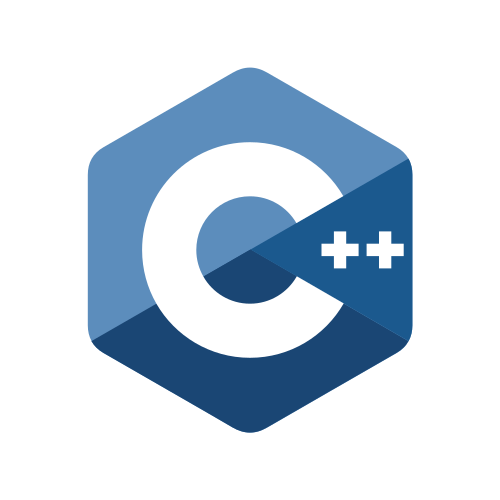

### Hi there 👋

```js
const Deniz_Umut_Dereli = {
  title:
    "Senior Full Stack Developer, Software/Database Architect",
  contact: {
    linkedin: "denizumutdereli",
    email: "denizumutdereli@gmail.com",
  },
};
```
### Languages




